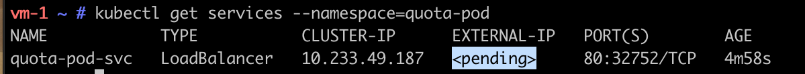
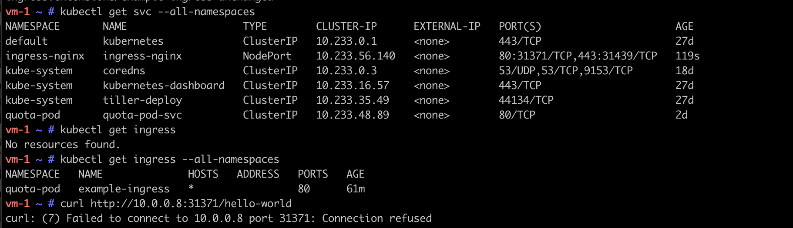

# kubernetes
## Install
ansible-playbook plays/k8s-setup.yml --ask-pass --extra-vars "ansible_become_pass=Laetitia1998."
### Test
ssh laetitia@40.89.156.250
sudo -i
kuberctl get nodes

# TD
## 1. Create namespace and associate quota
######  Connect to vm-1
ssh laetitia@52.143.154.155
###### Create namespace
kubectl create namespace quota-pod
###### Create resource quota
kubectl apply -f configure-quotas.yml --namespace=quota-pod
###### View information
kubectl get resourcequota quota-pod --namespace=quota-pod --output=yaml

## 2. Create dockerclound/hello-world
###### Create deployment for dockercloud/hello-world
kubectl apply -f create-deployment.yml --namespace=quota-pod
###### View information
kubectl get deployment pod-quota --namespace=quota-pod --output=yaml 

###### Create service
kubectl apply -f create-service.yml --namespace=quota-pod

# ERROR
kubectl get services --namespace=quota-pod

 
## 3. Create ingress
kubectl apply -f ingress-deploy.yml
kubectl apply -f ingress-controller-nginx.yml
kubectl apply -f ingress-resources.yml --namespac=quota-pod

kubectl get svc --all-namespaces

###### http://52.143.154.155:PORT_EXT/hello-world

